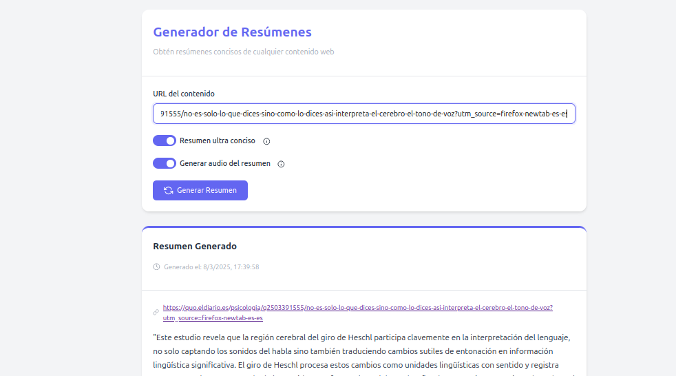

# URL Summarizer

URL Summarizer es una aplicación que extrae el contenido de una URL, lo envía a un servicio externo de LLM para generar un resumen y lo muestra en pantalla. Además, ofrece la opción de generar un audio del resumen utilizando otro servicio externo.

<div align="center">
  
</div>

## Características
- Extrae el contenido de una URL y lo resume utilizando un servicio externo de LLM.
- Permite generar un audio del resumen mediante un servicio de conversión de texto a voz.
- Diseñado para ejecutarse en un entorno local (self-hosted).
- Se ejecuta con Docker para facilitar su despliegue.

## Servicios externos de dependencia

En general, en mi servidor self-hosted, todos los servicios corren en Docker. Esta aplicación depende de que tengas ejecutándose servicios como los siguientes ejemplos:
   - Un LLM, estoy usando Ollama: [ollama Docker Hub](https://hub.docker.com/r/ollama/ollama)
   - Generador de texto a audio: [long_text_coqui GitHub](https://github.com/manologcode/long_text_coqui)

## Instalación y Ejecución

Para ejecutar este servicio tienes las siguientes opciones:

- En el archivo `docker-compose.yml` se encuentran las variables que apuntan a los servicios. Pueden ser el nombre del servicio Docker o la dirección de red:
   ```sh
      - URL_XTTS=http://192.168.1.69:5008
      - LLM_MODEL=mistral
      - LLM_URL=http://ollama:11434/api/generate
   ```

- Ejecuta la aplicación directamente con Docker:
   ```sh
   docker run -d \
   --name url_summarizer \
   -p 5001:5088 \
   -e URL_XTTS=http://192.168.1.69:5008 \
   -e LLM_MODEL=mistral \
   -e LLM_URL=http://192.168.1.69:11434/api/generate \
   manologcode/url_summarizer
   ```

Cuando el servicio esta en marcha se accede a la aplicación en tu navegador en `http://localhost:5001`.


